## Description
This analysis was completed from February-November 2025 using single nucleus RNA-seq data collected in 2023 and 2024 by the Trainor lab in the UC Davis Department of Psychology. Analysis guidance was provided by the Nord lab at the UC Davis Center for Neuroscience. Findings were presented at the Society for Neuroscience meeting in San Diego, CA in November 2025.

BNST samples were collected from 24 California mice (*Peromyscus californicus*) (N = 12 males, 12 females). Sequencing was performed by the UC Davis Bioinformatics Core using the 10x Genomics Chromium Nuclei Isolation kit, yielding ~250,000 sequenced nuclei. Raw data was processed with the 10X Genomics CellRanger pipeline before analysis in RStudio using Seurat v5.

## Summary of coding steps
**1. BNST Preprocessing** \
Seurat object creation \
Quality control/filtering 

*Sample QC output* \
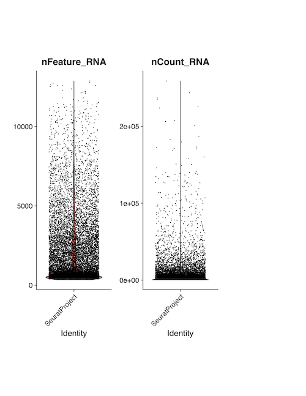 \
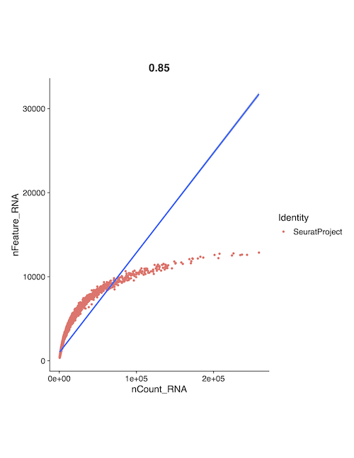 \
[Download high-resolution PDF](1-preprocessing/BNST_QCplots_femc1_rearranged.pdf)

Normalization (SCTransform) \
Principal components analysis (PCA) \
Clustering

**2. BNST Cell type assignment** \
Reference data Seurat object creation \
Reference data normalization, PCA, & clustering \
Reference-query data mapping 

*Sample reference-query data mapping output* \
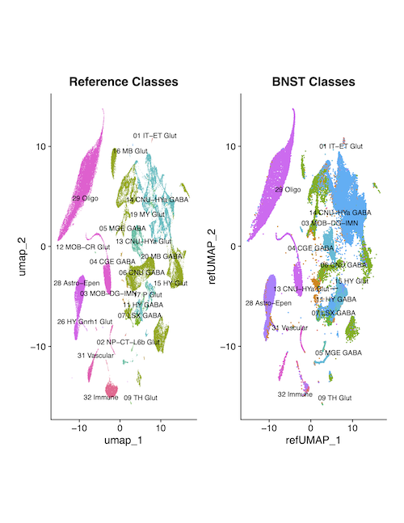 \
[Download high-resolution PDF](2-cell_type_assignment/BNST_controls_celltype_mapping_plots_condensed.pdf)

By-cluster cell type voting

*Sample by-cluster voting output* \
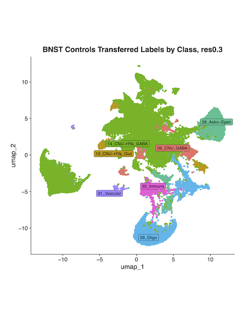 \
[Download high-resolution PDF](2-cell-type_assignment/BNST_controls_by-cluster_voting_plots.pdf)

**3. Analysis of all BNST neurons** \
Quality control, filtering for non-BNST contamination

*Sample QC output* \
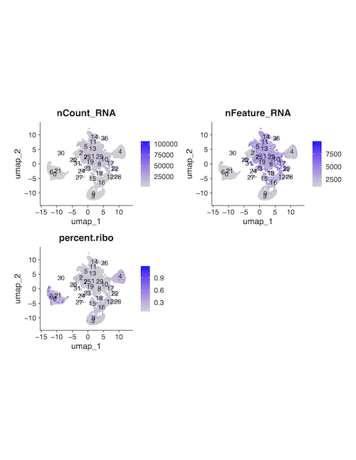 \
[Download high-resolution PDF](3-all_neurons/BNST.controls_nonfilt_mapped_qc_plots_condensed.pdf)

*Sample UMAP prior to filtering* \
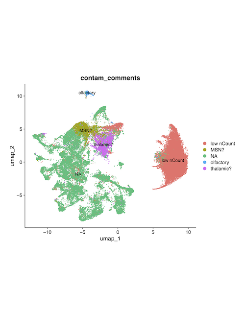 \
[Download high-resolution PDF](3-all_neurons/BNST.control_neurons_prefilt_umap.pdf)

Subset neurons

*Batch effects check* \
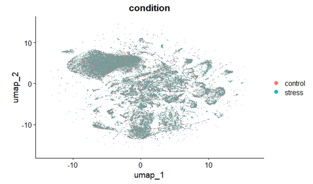

Normalization, PCA, and clustering of neurons \
By-cluster differential expression (DE) analysis \
Cluster marker inspection \
Cluster labeling

*UMAP with labeled neuron clusters* \
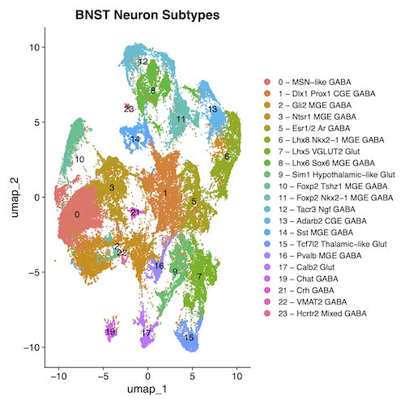 \
[Download high-resolution PDF](3-all_neurons/BNST.merged_neurons_labeled3.pdf)

**4. Analysis of BNST PVN-like neuron cluster (cluster 9)** \
Subset cluster 9 \
Normalization, PCA, and subclustering of cluster 9 neurons \
By-cluster DE analysis \
Cluster marker inspection \
Cluster labeling

*UMAP of cluster 9 subclusters* \
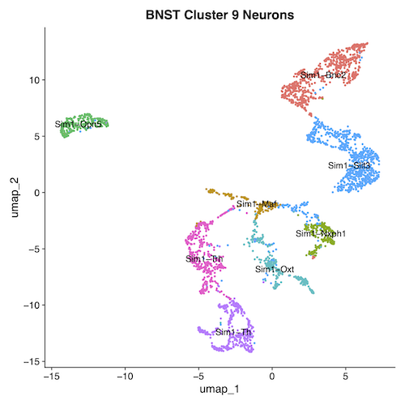 \
[Download high-resolution PDF](4-cluster9_neurons/BNST.neurons_cluster9_umap_labeled.pdf)

*UMAP of oxytocin neurons on cluster 9 subclusters* \
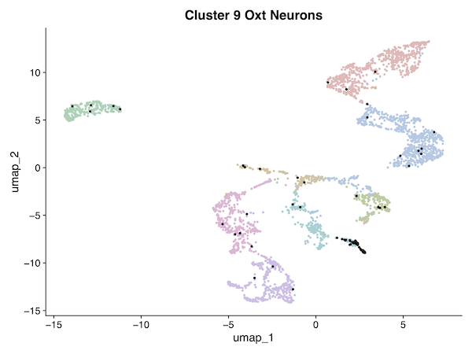 \
[Download high-resolution PDF](4-cluster9_neurons/BNST.oxtneurons_on_clus9neurons.pdf)

**5. Analysis of BNST oxytocin neurons** \
Oxytocin (Oxt) expression inspection \
Subset Oxt-expressing neurons 

*Oxytocin neuron distribution* \
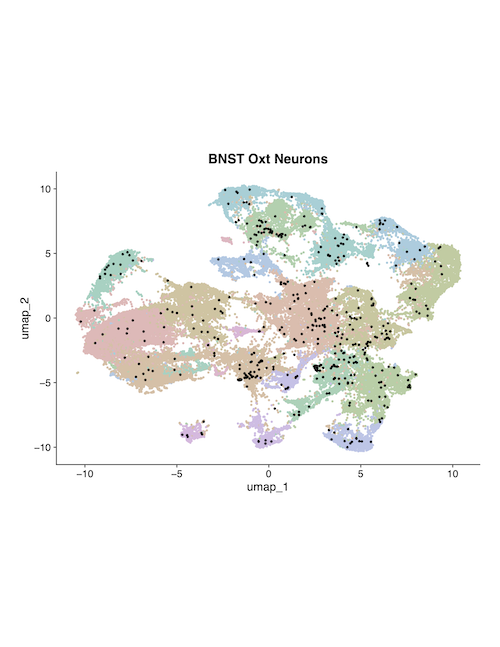 \
[Download high-resolution PDF](5-oxytocin_neurons/BNST.oxt_neurons_on_all_neurons_condensed.pdf)

Normalization, PCA, and subclustering of Oxt neurons \
By-subcluster Oxt expression inspection

*Oxytocin expression in oxytocin neuron subclusters* \
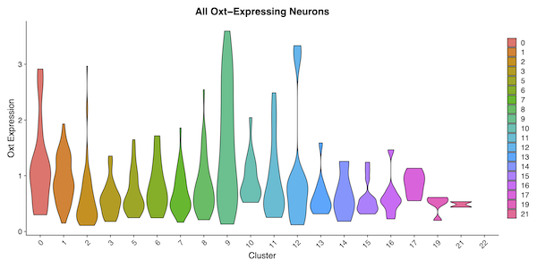 \
[Download high-resolution PDF](5-oxytocin_neurons/BNST.oxt_neurons_oxt_expr_by_cluster.pdf)

## Limitations
This analysis was exploratory and had limited sample sizes. Full reproducibility has not been verified in the 
current R environment, and results should be interpreted with caution. This workflow should serve as a reference
for analytical approaches rather than definitive conclusions. \
-The data was not demultiplexed, so expression could not be compared at the level of biological replicates.

## Future directions / Things to change 
-SCTransform should be performed on individual samples rather than merged control and stress objects. \
-Cell typing could be performed on control and stress data together to streamline the workflow. \
-Module-based cell type scoring could be used instead of label transfer to streamline the worklow
 if only interested in identifying one cell type. \
-QC may have been too stringent (multiple rounds of filtering), could try using more lenient parameters and see if results are consistent.

 

